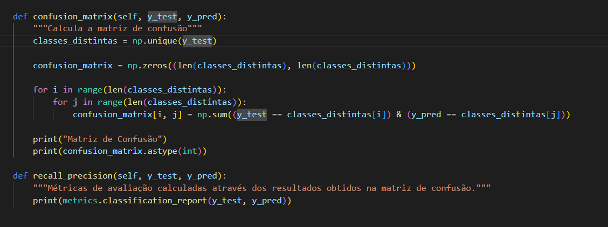

# Trabalho Programação

Grupo: 

    Ana Cerqueira 
    Duarte Teixeira
    Juliana Duarte

## Objetivo

Este trabalho tem como objetivo a implementação do algoritmo de Nearest Neighbors (K-NN) em python sem a utilização de bibliotecas adicionais que incluam vários passos do algoritmo. 
O algoritmo desenvolvido deverá ser claro e de fácil utilização. 

O algoritmo desenvolvido deverá solicitar ao utilizador:

    * O valor de neighbors (k) a considerar;
    * A necessidade de se normalizar os dados. 

## K-NN

Este algoritmo é um método supervisionado, não paramétrico, que permite a classificação de um novo elemento por comparação deste com um grupo de pontos vizinhos mais próximos. Baseia-se portanto na assunção de que pontos semelhantes podem ser encontrados próximos uns dos outros.
Pode ser aplicado tanto em problemas de classificação como de regressão, embora seja mais comum vermos a sua aplicação em problemas de classificação. 

* Como é que funciona este algoritmo? 

Suponhamos que, tal como vemos na Imagem 1, temos um conjunto de elementos agrupados em duas classes distintas - pontos verdes e pontos vermelhos - e que se pretente descobrir a que classe pertence o novo ponto - representado a amarelo - usando o algoritmo de K-NN.  

Imagem 1 - Representação dos elementos de duas classes distintas - representados a vermelho e verde - e de um elemento a classificar - representado a amarelo.

A base deste método consiste em, calcular a distância deste novo ponto relativamente a todos os outros e escolher os K elementos mais próximos de si. Usando estes k elementos, determina-se qual a classe em maioria nestes elementos e essa classe é atribuída ao elemento em estudo. 
Usando o exemplo anterior, o primeiro passo consiste em calcular todas as distâncias aos elementos do conjunto inicial - Imagem 2. Usando estas distâncias, e assumindo que estamos num caso em que K = 2, selecionamos os três elementos mais próximos - Imagem 3. Como neste caso todos os elementos deste subconjunto são verdes (classe em maioria neste caso é verde), então o novo elemento será classificado como verde - Imagem 4.  

Imagem 2

Imagem 3

Imagem 4

Em alguns problemas existe a necessidade de pré-processar os dados. No caso do presente trabalho vamos considerar a necessidade de normalizar os dados. Esta informação deverá ser providênciada pelo utilizador no início da execução, em conjunto com o número pretendido de neighbors (K). 

## Exemplo

O algoritmo desenvolvido permite determinar a classe de um novo elemento por comparação com os k elementos mais próximos do conjunto de dados em estudo. 

Para se iniciar a classe, denominada de KNN, são necessários dois argumentos:

    * K - número de nearest neighbors a considerar; 
    * normalilzation_need - Boolean que define a necessidade de se normalizar os dados ou não. 

Caso estes dois valores não estejam definidos, por defeito utilizam-se K=1 e normalilzation_need = False. 

Na imagem 5 apresenta-se um exemplo da criação da classe KNN desenvolvida. No caso, pretende-se criar uma classe para 2 nearest neighbors em que existe a necessidade de se normalizar os dados. Para além disso, realiza-se a previsão da classe dos elementos `x_unknown_class` cujos valores são `[7, 3.5 , 6, 3]`. Na imagem 6 apresenta-se o output obtido para este exemplo.

Imagem 5 

Imagem 6

É importante ressalvar que para o cálculo da distância entre elementos considerou-se a distância euclidiana e Z-score normalization - Imagem 7

Imagem 7

Para além do trabalho já apresentado, tentou-se implementar ainda as funções para calcular a matriz de confusão, recall e precision, conforme se apresenta na imagem 8.

Imagem 8

